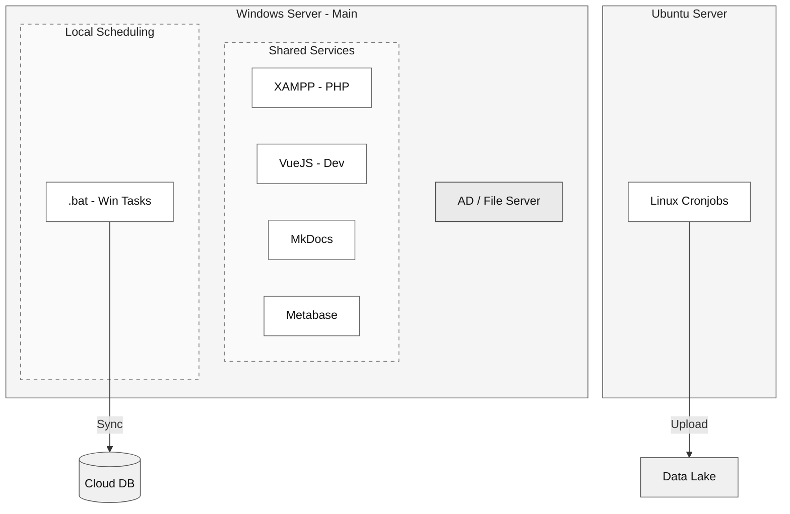
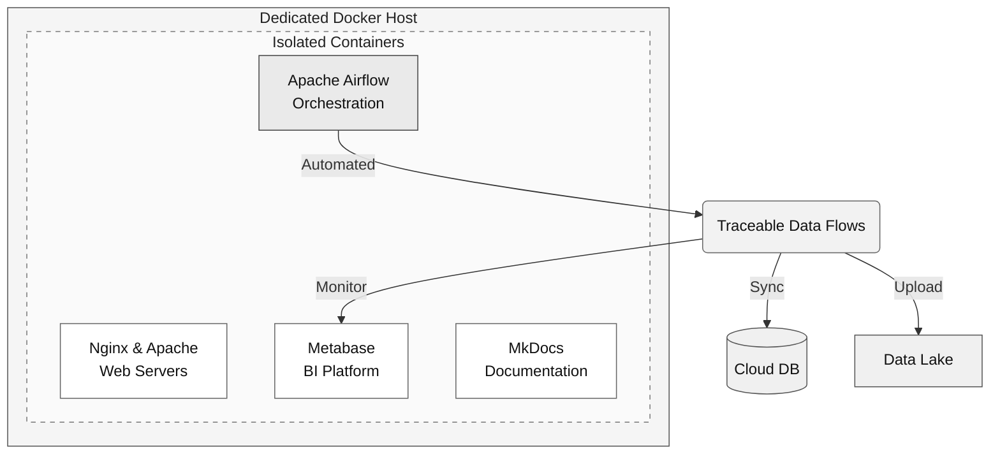
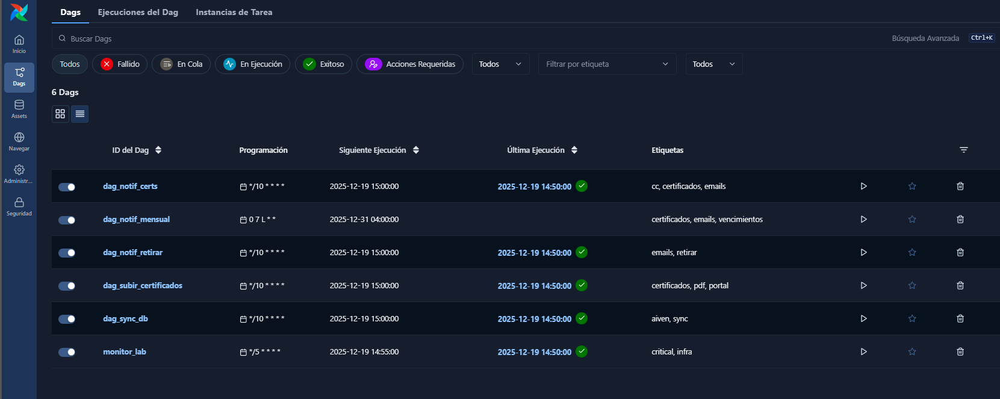

# Operational Reorganization: Legacy Infrastructure to DataOps Framework

### Project Overview
This project covers an infrastructure migration that moved critical services, ETL pipelines, and frontends from a fragile, decentralized Windows environment to a dedicated, containerized platform.

The goal was to reduce operational risks by isolating services and centralizing orchestration with **Docker Compose** and **Apache Airflow**—moving from an operationally fragile setup to a more stable, traceable infrastructure.

---

### 1. The Legacy Problem: Shared Infrastructure Risks
Initially, all automation tasks, databases, and internal services ran directly on the lab's primary **Active Directory (AD) and File Server**. Running everything on one server created several problems:




*   **Resource Conflicts:** Running heterogeneous tools like **XAMPP (PHP)**, **Metabase**, and **MkDocs** on the same VM as the AD server caused performance issues and dependency conflicts.
*   **Dev Runtimes in Production:** Critical web interfaces were running in development mode (e.g., `npm run dev` for VueJS), leading to unstable sessions and inefficient resource use on a server managing network identity.
*   **Infrastructure Fragility:** An error in an experimental script or development update could affect core Windows services.
*   **Operational "Black Boxes":** Critical processes ran on unmonitored **Windows Scheduled Tasks (.bat files)** and **Linux cronjobs**. There was no visibility into execution history or failure points, requiring constant manual checks.


---

### 2. Infrastructure Transition: Isolation and Order

The migration introduced a dedicated Docker host where each service runs as an isolated container managed through a single docker-compose configuration, establishing a predictable operational boundary between infrastructure, applications, and automation workflows.



*   **Service Isolation:** Moving tools into independent containers means a failure in one application (like an internal frontend) doesn't affect the rest.
*   **Production Stability:** Development runtimes were replaced with optimized production builds served via **Nginx**, reducing server load.
*   **Documentation Centralization:** Technical setups were documented using **MkDocs**, making them accessible to the team.


Five key services were defined to operate in an isolated and manageable way:

| Containerized Service | Function | Operational Value (Tech Lead / Operations) |
| :--- | :--- | :--- |
| **Apache Airflow** | Data workflow orchestration platform. | Centralizes ETL, monitoring, and retries (replaces Windows .bat files and Linux cronjobs). |
| **Apache** | Static web server. | Moving from XAMPP to a dockerized Apache server standardizes services under a single configuration panel. |
| **Nginx** | Static web server. | Migrating from a development runtime (`npm run dev`) to a production build ensures a stable deployment with minimal resource consumption. |
| **Metabase** | Retains original functionality. | Dedicated, isolated service for consuming modeled data. |
| **MkDocs** | Retains original functionality. | Environment consistency and ease of maintenance. |

---

### 3. Transition to DataOps: Orchestration and Reliability
A key part of the project was consolidating scattered scripts into a unified orchestration layer. Manual and unstable processes were converted into auditable **DAGs**:

1.  **Data Consistency Pipeline:** Replaced ad-hoc MySQL synchronization scripts with a reliable flow that includes automatic retry logic for network failures.
2.  **Automated Asset Management:** Modernized PDF certificate uploads to the data lake, replacing unstable cronjobs with a traceable process.
3.  **Notification Engine:** Automated customer alerts that previously depended on individual user sessions, ensuring consistent delivery and historical records.
</br>
>The Airflow interface provides operational visibility into these workflows, exposing execution history, retry logic, and task dependencies. The screenshot below illustrates the DAG environment where these processes are orchestrated and monitored.
</br>



---

### 4. Health Monitoring and System Observability
Finding service failures in the legacy environment often meant manually checking multiple terminal windows. To fix this, a dedicated **"Monitor DAG"** was added:

*   **Real-time Visibility:** The system automatically checks container and service status, reporting results to a database.
*   **Centralized Health Dashboard:** Logs are visualized in **Metabase**, providing immediate evidence of system health without searching through server logs.

---

### 5. Final Impact
*   **Server Relief:** Offloaded non-core tasks from the Active Directory server, protecting its stability and the lab's network security.
*   **Audit Readiness:** Every automated task now leaves a permanent record of *where*, *when*, and *why* it ran, meeting traceability requirements for **ISO 17025** compliance.
*   **Reduced Manual Overhead:** Automated health checks and retries reduced the need for daily manual oversight.
*   **Maintainability:** The entire stack is documented in a single `docker-compose.yml` file, making it easier for new team members to understand and maintain.


<details>
<summary style="cursor:pointer"><strong>docker-compose.yml (simplified):</strong></summary>

```yaml
    version: '3.8'

    x-airflow-common: &airflow-common
        image: ${AIRFLOW_IMAGE_NAME:-apache/airflow:2.7.1}
        env_file: [ .env ]
        volumes:
            - ${SERVICES_PATH}/airflow/dags:/opt/airflow/dags
            - ${SERVICES_PATH}/airflow/logs:/opt/airflow/logs
        user: "50000:0"
        depends_on: [ postgres ]

    services:
        postgres:
            image: postgres:16
            environment:
                POSTGRES_USER: ${POSTGRES_USER}
                POSTGRES_PASSWORD: ${POSTGRES_PASSWORD}
                POSTGRES_DB: ${POSTGRES_DB}
            volumes:
                - postgres-db-volume:/var/lib/postgresql/data
            restart: always

        mkdocs:
            build: ${SERVICES_PATH}/mkdocs
            container_name: centec_mkdocs
            ports:
                - "${PORT_MKDOCS}:8000"
            volumes:
                - ${VOLUMES_PATH}/mkdocs-data:/docs
            restart: always

        kanban:
            build: ${SERVICES_PATH}/kanban
            container_name: centec_kanban
            ports:
                - ${PORT_KANBAN}:80
            restart: always

        metabase:
            image: metabase/metabase
            container_name: centec_metabase
            ports:
                - ${PORT_METABASE}:3000
            volumes:
                - ${VOLUMES_PATH}/metabase-data:/metabase-data
            environment:
                - MB_DB_FILE=/metabase-data/metabase.db
            restart: always

        apache:
            build: ./services/apache
            container_name: centec_apache
            ports:
                - "${PORT_APACHE}:80" 
            volumes:
                - ${VOLUMES_PATH}/apache_data:/var/www/html
            restart: always

        airflow_web:
            <<: *airflow-common
            container_name: centec_airflow_web
            ports: ["${PORT_AIRFLOW}:8080"]
            command: webserver

        airflow_scheduler:
            <<: *airflow-common
            container_name: centec_airflow_scheduler
            command: scheduler
```

</details>